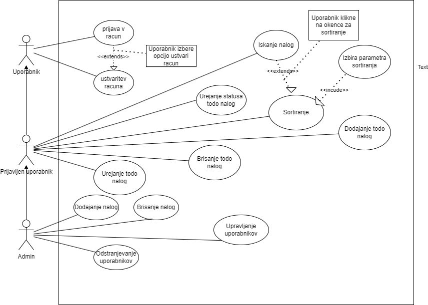

# ToDo

## 1. Namen aplikacije

**To-Do** je preprosta in intuitivna aplikacija za upravljanje nalog, ki uporabnikom omogoča organizacijo in sledenje njihovim opravilom. Namenjena je uporabnikom, ki želijo izboljšati svojo produktivnost, upravljati vsakodnevna opravila ali enostavno spremljati napredek pri delu na različnih projektih. Aplikacija sledi arhitekturi `frontend-backend`, kjer frontend skrbi za uporabniški vmesnik, backend pa za poslovno logiko in komunikacijo z bazo podatkov.

## 2. Projektna struktura

Projekt je razdeljen v dve glavni komponenti:

- **/frontend**: Vsebuje kodo za uporabniški vmesnik (UI), izdelano z uporabo [izberi tehnologijo, npr. React, Angular]. Vsebuje vse datoteke in mape, ki so povezane s prikazovanjem podatkov, navigacijo in interakcijami z uporabniki.
- **/backend**: Služi kot strežniška stran aplikacije, implementirana v [izberi tehnologijo, npr. Node.js, Express]. Backend vsebuje poslovno logiko, API-je za komunikacijo s frontendom ter dostop do baze podatkov.
- **/database**: Vsebuje datoteko `init.sql`, ki vsebuje SQL skripto za inicializacijo baze podatkov (ustvarjanje baze, tabel in začetnih podatkov).
- **README.md**: Dokumentacija za namestitev in razvoj aplikacije.

## 3. Standardi kodiranja

Projekt sledi naslednjim standardom kodiranja:

- **JavaScript**: Vsi JavaScript (ali TypeScript) moduli in komponente sledijo pravilom za poimenovanje z `camelCase`. Funkcije in spremenljivke se začnejo z malimi črkami, razredi pa z veliko.
- **Linting**: Uporabljamo ESLint za ohranjanje čistosti in enotnosti kode.
- **Formatiranje**: Koda je formatirana s pomočjo Prettier, kar zagotavlja enotno obliko.
- **Komentiranje**: Ključne funkcije in komponente so dokumentirane z JSDoc.

---

## 4. Navodila za nameščanje

### 4.1 Predpogoji

- [Node.js](https://nodejs.org/) (priporočena verzija 16 ali več)
- [npm](https://www.npmjs.com/) za upravljanje paketov
- SQL baza podatkov (MySQL)

### 4.2 Koraki za namestitev

#### 1. Kloniranje repozitorija

Najprej klonirajte repozitorij na svoj računalnik:

```bash
git clone https://github.com/kihecpihec/ToDo.git
cd ToDo
```

## 5. DPU



## 6. Besednjak

### 6.1 Naloga (Task)
-**Definicija:** Osnovna enota v aplikaciji, ki predstavlja opravilo ali cilj, ki ga želi uporabnik doseči.

-**Uporaba:** Naloge lahko uporabnik oznaci (narejeno, nenarejeno, v poteku...), zato da vidi svoj napredek.
### 6.2 Rok (Deadline)
-**Definicija:** Določen datum, do kdaj naj bo naloga dokončana.

-**Uporaba:** Uporabnik lahko nastavi rok za vsako nalogo, da jo lažje opravi pravočasno.
### 6.3 Prioriteta (Priority)
-**Definicija:** Vrednost, ki nalogi določa njeno pomembnost. Običajno je rangirana od "nizke" do "visoke" prioritete.

-**Uporaba:** Uporabniki lahko določijo prioriteto vsaki nalogi, kar omogoča lažjo organizacijo opravil po pomembnosti.
### 6.4  Iskalna vrstica (Search Bar)
-**Definicija:** Orodje v uporabniškem vmesniku, ki omogoča uporabnikom, da hitro poiščejo določeno nalogo.

-**Uporaba:** Uporabniki lahko hitro najdejo specifične naloge z vnosom besed v iskalno vrstico, kar izboljša navigacijo med številnimi nalogami.
### 6.5 Uporabnik (User)
-**Definicija:** Oseba, ki uporablja aplikacijo "To-Do" za organizacijo in upravljanje svojih nalog.

-**Uporaba:** Uporabnik se lahko registrira in prijavi v aplikacijo, da dostopa do svojih osebnih seznamov nalog, doda nove naloge, označi naloge kot opravljene, ter uporablja iskalne funkcije za učinkovitejše sledenje napredku.