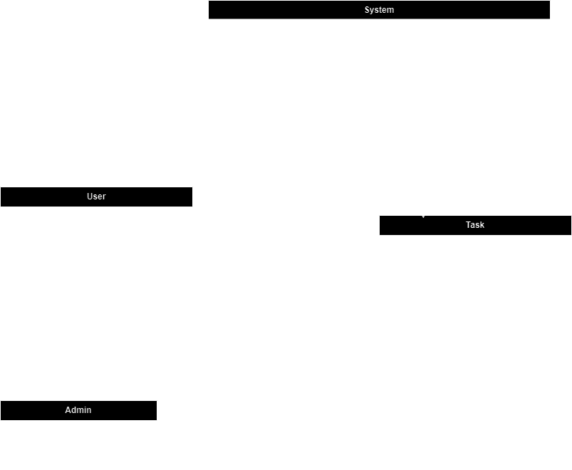

# ToDo

## Vizija projekta

**Cilj aplikacije** je uporabnikom omogočiti enostaven in intuitiven način za ustvarjanje, urejanje in sledenje dnevnim opravilom ali večjim projektom. To-Do želi izboljšati uporabniško izkušnjo upravljanja z nalogami tako, da združi enostavnost uporabe in funkcionalnosti, ki so uporabnikom resnično v pomoč, kot so opomniki, prioritizacija nalog ter organizacija v skupine ali projekte. Aplikacija je namenjena tako posameznikom kot ekipam, ki želijo učinkoviteje organizirati svoj čas, povečati osredotočenost na ključna opravila in zmanjšati občutek preobremenjenosti.

## Sodelujoči

- Jan Ančevski
- Tilen Gabor
- Hanan Mešić

## 1. Namen aplikacije

**ToDo** je preprosta in intuitivna aplikacija za upravljanje nalog, ki uporabnikom omogoča organizacijo in sledenje njihovim opravilom. Namenjena je uporabnikom, ki želijo izboljšati svojo produktivnost, upravljati vsakodnevna opravila ali enostavno spremljati napredek pri delu na različnih projektih. Aplikacija sledi arhitekturi `frontend-backend`, kjer frontend skrbi za uporabniški vmesnik, backend pa za poslovno logiko in komunikacijo z bazo podatkov.

## 2. Projektna struktura

Projekt je razdeljen v dve glavni komponenti:

- **/frontend**: Vsebuje kodo za uporabniški vmesnik (UI), izdelano z uporabo [izberi tehnologijo, npr. React, Angular]. Vsebuje vse datoteke in mape, ki so povezane s prikazovanjem podatkov, navigacijo in interakcijami z uporabniki.
- **/backend**: Služi kot strežniška stran aplikacije, implementirana v [izberi tehnologijo, npr. Node.js, Express]. Backend vsebuje poslovno logiko, API-je za komunikacijo s frontendom ter dostop do baze podatkov.
- **/database**: Vsebuje datoteko `init.sql`, ki vsebuje SQL skripto za inicializacijo baze podatkov (ustvarjanje baze, tabel in začetnih podatkov).
- **README.md**: Dokumentacija za namestitev in razvoj aplikacije.

## 3. Standardi kodiranja

Projekt sledi naslednjim standardom kodiranja:

- **JavaScript**: Vsi JavaScript (ali TypeScript) moduli in komponente sledijo pravilom za poimenovanje z `camelCase`. Funkcije in spremenljivke se začnejo z malimi črkami, razredi pa z veliko.
- **Linting**: Uporabljamo ESLint za ohranjanje čistosti in enotnosti kode.
- **Formatiranje**: Koda je formatirana s pomočjo Prettier, kar zagotavlja enotno obliko.
- **Komentiranje**: Ključne funkcije in komponente so dokumentirane z JSDoc.

---

## 4. Navodila za nameščanje

### 4.1 Predpogoji

- [Node.js](https://nodejs.org/) (priporočena verzija 16 ali več)
- [npm](https://www.npmjs.com/) za upravljanje paketov
- SQL baza podatkov (MySQL)

### 4.2 Koraki za namestitev

#### 1. Kloniranje repozitorija

Najprej klonirajte repozitorij na svoj računalnik:

```bash
git clone https://github.com/kihecpihec/ToDo.git
cd ToDo
```

#### 2. Namestitev odvisnosti

V korenski mapi in podmapah za frontend in backend namestite vse potrebne odvisnosti:

```bash
cd frontend
npm install
```

#### 3. Zagon aplikacije

V backend mapi zaženite strežnik, nato zaženite aplikacijo na frontendu.

```bash
cd frontend
node index.js
```

## 5. DPU

### 5.1 Diagram


### 5.2 Use case opisi

**Primer uporabe: Prijava v račun**  
**ID:** UC1  
**Cilj:** Uporabnik želi dostopati do svojega računa, kjer lahko upravlja naloge.  
**Akterji:** Uporabnik  
**Predpogoji:** Uporabnik že ima ustvarjen račun.  
**Stanje sistema po PU:** Sistem uporabnika prepozna kot prijavljenega in mu omogoči dostop do funkcionalnosti.

**Scenarij:**

1. Uporabnik odpre aplikacijo in izbere možnost "Prijava".
2. Sistem prikaže polji za vnos uporabniškega imena in gesla.
3. Uporabnik vnese svoje podatke in pritisne "Prijava".
4. Sistem preveri pravilnost podatkov in uporabnika prijavi v račun.

**Alternativni tokovi:**  
Uporabnik lahko izbere možnost za ponastavitev gesla, če ga je pozabil.

**Izjeme:**  
Če uporabniško ime ali geslo nista pravilna, sistem prikaže sporočilo o napaki.

---

**Primer uporabe: Ustvarjanje računa**  
**ID:** UC2  
**Cilj:** Uporabnik želi ustvariti nov račun, da lahko dostopa do funkcionalnosti aplikacije.  
**Akterji:** Uporabnik  
**Predpogoji:** Uporabnik ima dostop do aplikacije in ima vzpostavljeno stabilno internetno povezavo.  
**Stanje sistema po PU:** Sistem ustvari nov račun za uporabnika in shrani njegove podatke.

**Scenarij:**

1. Uporabnik izbere možnost "Ustvari račun".
2. Sistem prikaže polja za vnos osebnih podatkov (uporabniško ime, geslo, e-pošta).
3. Uporabnik vnese zahtevane podatke in pritisne "Potrdi".
4. Sistem preveri pravilnost podatkov in ustvari nov račun.

**Alternativni tokovi:**  
Če uporabniško ime ali e-pošta že obstajata, sistem prikaže opozorilo.

**Izjeme:**  
Če so podatki nepopolni ali napačno vneseni, sistem prikaže sporočilo o napaki.

---

**Primer uporabe: Dodajanje To-Do nalog**  
**ID:** UC3
**Cilj:** Uporabnik želi ustvariti novo nalogo, ki jo bo lahko spremljal in urejal.  
**Akterji:** Prijavljen uporabnik  
**Predpogoji:** Uporabnik je prijavljen.  
**Stanje sistema po PU:** Sistem shrani novo nalogo in jo prikaže uporabniku.

**Scenarij:**

1. Uporabnik izbere možnost "Dodaj novo nalogo".
2. Sistem prikaže obrazec za vnos podrobnosti naloge (naziv, rok, prioriteta).
3. Uporabnik vnese podatke in pritisne "Shrani".
4. Sistem shrani nalogo in jo prikaže na seznamu nalog.

**Alternativni tokovi:**  
Če uporabnik zapre obrazec brez shranjevanja, se naloga ne ustvari.

**Izjeme:**  
Če so podatki nepopolni ali napačno vneseni, sistem prikaže sporočilo o napaki.

---

**Primer uporabe: Brisanje To-Do nalog**  
**ID:** UC4
**Cilj:** Uporabnik želi izbrisati obstoječo nalogo.  
**Akterji:** Prijavljen uporabnik  
**Predpogoji:** Uporabnik je prijavljen in ima obstoječo nalogo.  
**Stanje sistema po PU:** Sistem izbriše nalogo in jo odstrani s seznama nalog.

**Scenarij:**

1. Uporabnik izbere možnost za brisanje ob nalogi.
2. Sistem prikaže obvestilo za potrditev brisanja.
3. Uporabnik potrdi brisanje.
4. Sistem izbriše nalogo in jo odstrani s seznama.

**Alternativni tokovi:**  
Če uporabnik prekliče brisanje, se naloga ohrani.

**Izjeme:**  
Če pride do napake pri brisanju, sistem prikaže obvestilo o napaki.

---

**Primer uporabe: Vzdrževanje backenda**  
**ID:** UC5
**Cilj:** Admin želi poskrbeti za nemoteno delovanje aplikacije s preverjanjem in posodabljanjem back-end sistema.  
**Akterji:** Admin  
**Predpogoji:** Admin mora imeti dostop do skrbniškega računa in sistem mora delovati.  
**Stanje sistema po PU:** Backend sistema je posodobljen ali optimiziran za delovanje.

**Scenarij:**

1. Admin se prijavi v skrbniški račun.
2. Admin dostopa do konzole za upravljanje sistema.
3. Admin pregleda stanje backenda, zazna morebitne težave ali možnosti za izboljšave.
4. Admin izvede potrebne posodobitve ali popravke in preveri, če vse deluje pravilno.

**Alternativni tokovi:**  
Če sistem ne deluje pravilno, admin ponovno preveri nastavitve in izvede diagnostiko.

**Izjeme:**  
Če pride do napake pri posodabljanju, sistem prikaže obvestilo o napaki in admin poskuša težavo odpraviti ali ponastaviti sistem.

---

**Primer uporabe: Vzdrževanje frontenda**  
**ID:** UC6  
**Cilj:** Admin želi posodobiti ali optimizirati uporabniški vmesnik, da izboljša uporabniško izkušnjo.  
**Akterji:** Admin  
**Predpogoji:** Admin mora imeti dostop do skrbniškega računa.  
**Stanje sistema po PU:** Sistem uporabniški vmesnik je posodobljen in optimiziran.

**Scenarij:**

1. Admin se prijavi v skrbniški račun.
2. Admin dostopa do nastavitev za frontend.
3. Admin pregleda uporabniški vmesnik in zazna morebitne težave ali izboljšave.
4. Admin izvede potrebne posodobitve in preveri, če vse deluje pravilno.

**Alternativni tokovi:**  
Če pride do napake pri izvedbi sprememb, admin pregleda nastavitve in ponovi postopek.

**Izjeme:**  
Če pride do napake pri posodabljanju vmesnika, sistem prikaže obvestilo o napaki.

---

**Primer uporabe: Dodajanje nalog**  
**ID:** UC7  
**Cilj:** Admin želi dodati novo nalogo za uporabnike.  
**Akterji:** Admin  
**Predpogoji:** Admin mora biti prijavljen v sistem in imeti ustrezna dovoljenja za dodajanje nalog.  
**Stanje sistema po PU:** Sistem doda novo nalogo v seznam nalog.

**Scenarij:**

1. Admin se prijavi v sistem.
2. Admin izbere možnost "Dodaj nalogo".
3. Sistem prikaže obrazec za vnos podrobnosti naloge (naziv naloge, rok, prioritetna raven).
4. Admin vnese podatke in klikne "Shrani".
5. Sistem shrani nalogo in jo prikaže v seznamu nalog.

**Alternativni tokovi:**  
Če admin ne vnese vseh obveznih podatkov, sistem prikaže opozorilo o manjkajočih informacijah.

**Izjeme:**  
Če pride do napake pri shranjevanju naloge, sistem prikaže obvestilo o napaki.

---

**Primer uporabe: Brisanje nalog**  
**ID:** UC8
**Cilj:** Admin želi izbrisati obstoječo nalogo iz sistema.  
**Akterji:** Admin  
**Predpogoji:** Admin mora biti prijavljen v sistem in imeti ustrezna dovoljenja za brisanje nalog.  
**Stanje sistema po PU:** Naloga je odstranjena iz sistema.

**Scenarij:**

1. Admin se prijavi v sistem.
2. Admin izbere nalogo, ki jo želi izbrisati.
3. Sistem prikaže možnost za brisanje naloge.
4. Admin potrdi brisanje naloge.
5. Sistem izbriše nalogo iz sistema in odstrani jo iz seznama nalog.

**Alternativni tokovi:**  
Če admin prekliče postopek, naloga ostane v sistemu.

**Izjeme:**  
Če naloge ni mogoče izbrisati (npr. zaradi napake v sistemu), se prikaže obvestilo o napaki.

---

**Primer uporabe: Odstranjevanje uporabnikov**  
**ID:** UC9  
**Cilj:** Admin želi odstraniti uporabnika iz sistema.  
**Akterji:** Admin  
**Predpogoji:** Admin mora biti prijavljen in imeti ustrezna dovoljenja za odstranjevanje uporabnikov.  
**Stanje sistema po PU:** Uporabnik je odstranjen iz sistema.

**Scenarij:**

1. Admin se prijavi v sistem.
2. Admin izbere uporabnika, ki ga želi odstraniti.
3. Sistem prikaže možnost za odstranitev uporabnika.
4. Admin potrdi odstranitev uporabnika.
5. Sistem odstrani uporabnika in njegove podatke iz sistema.

**Alternativni tokovi:**  
Če admin prekliče postopek, uporabnik ostane v sistemu.

**Izjeme:**  
Če odstranitev uporabnika ni mogoča (npr. zaradi napake), sistem prikaže obvestilo o napaki.

---

**Primer uporabe: Spreminjanje uporabnikov**  
**ID:** UC10  
**Cilj:** Admin želi spremeniti podatke obstoječega uporabnika (npr. e-pošta, geslo).  
**Akterji:** Admin  
**Predpogoji:** Admin mora biti prijavljen v sistem in imeti ustrezna dovoljenja za spreminjanje uporabnikov.  
**Stanje sistema po PU:** Podatki uporabnika so spremenjeni.

**Scenarij:**

1. Admin se prijavi v sistem.
2. Admin izbere uporabnika, katerega podatke želi spremeniti.
3. Sistem prikaže obstoječe podatke uporabnika.
4. Admin spremeni podatke (npr. spremeni e-poštni naslov) in potrdi spremembe.
5. Sistem shrani nove podatke in prikaže posodobljeni profil uporabnika.

**Alternativni tokovi:**  
Če admin prekliče spremembe, uporabnikovi podatki ostanejo nespremenjeni.

**Izjeme:**  
Če sprememba podatkov ni mogoča (npr. zaradi napake v sistemu), se prikaže obvestilo o napaki.

---

**Primer uporabe: Iskanje nalog**  
**ID:** UC11  
**Cilj:** Uporabnik želi poiskati naloge, ki ustrezajo določenim kriterijem, kot so datum ali prioriteta, z dodatnim funkcionalnostjo sortiranja.  
**Akterji:** Prijavljen uporabnik  
**Predpogoji:** Uporabnik je prijavljen v sistem.  
**Stanje sistema po PU:** Sistem prikaže seznam nalog, filtriranih po določenih kriterijih in dodatno razvrščenih.

**Scenarij:**

1. Uporabnik izbere možnost "Iskanje nalog".
2. Sistem omogoči iskanje po različnih kriterijih (npr. po datumu, prioriteti).
3. Uporabnik vnese iskane kriterije (npr. naloge z visoko prioriteto) in potrdi iskanje.
4. Sistem prikaže seznam nalog, ki ustrezajo iskalnim kriterijem, sortirane po izbranem parameterju (npr. datum).

**Alternativni tokovi:**  
Če ni najdenih nalog, sistem prikaže sporočilo "Ni rezultatov".

**Izjeme:**  
Če pride do napake pri iskanju nalog, sistem prikaže obvestilo o napaki.

---

**Primer uporabe: Sortiranje**  
**ID:** UC12  
**Cilj:** Uporabnik želi sortirati naloge po različnih parametrih, kot so datum, prioriteta ali status.  
**Akterji:** Prijavljen uporabnik  
**Predpogoji:** Uporabnik je prijavljen v sistem.  
**Stanje sistema po PU:** Sistem prikaže seznam nalog, sortiran po izbranem parametru.

**Scenarij:**

1. Uporabnik izbere možnost "Sortiraj naloge".
2. Sistem omogoči izbiro različnih parametrov sortiranja (npr. datum, prioriteta, status).
3. Uporabnik izbere enega ali več parametrov za sortiranje.
4. Sistem prikaže seznam nalog, sortiran po izbranih parametrih.

**Alternativni tokovi:**  
Če uporabnik ne izbere parametra sortiranja, sistem prikaže seznam nalog brez razvrstitve.

**Izjeme:**  
Če pride do napake pri sortiranju, sistem prikaže obvestilo o napaki.

---

**Primer uporabe: Urejanje statusa To-Do nalog**  
**ID:** UC13
**Cilj:** Uporabnik želi spremeniti status To-Do naloge (npr. iz "V teku" v "Zaključeno").  
**Akterji:** Prijavljen uporabnik  
**Predpogoji:** Uporabnik je prijavljen v sistem in ima nalogo, ki jo lahko spremeni.  
**Stanje sistema po PU:** Status naloge je spremenjen.

**Scenarij:**

1. Uporabnik odpre seznam nalog in izbere nalogo, katere status želi spremeniti.
2. Sistem prikaže podrobnosti naloge.
3. Uporabnik izbere nov status naloge (npr. "Zaključeno").
4. Sistem posodobi status naloge in prikaže posodobljen seznam nalog.

**Alternativni tokovi:**  
Če uporabnik ne izbere statusa, se naloga ne spremeni.

**Izjeme:**  
Če sprememba statusa naloge ni mogoča (npr. zaradi napake v sistemu), se prikaže obvestilo o napaki.

---

**Primer uporabe: Urejanje ToDo nalog**  
**ID:** UC14  
**Cilj:** Uporabnik želi urediti podrobnosti obstoječe To-Do naloge (npr. naslov, opis, datum).  
**Akterji:** Prijavljen uporabnik  
**Predpogoji:** Uporabnik je prijavljen v sistem in ima nalogo, ki jo lahko ureja.  
**Stanje sistema po PU:** Podatki naloge so posodobljeni.

**Scenarij:**

1. Uporabnik odpre seznam svojih nalog.
2. Uporabnik izbere nalogo, ki jo želi urediti.
3. Sistem prikaže podrobnosti naloge.
4. Uporabnik spremeni podatke naloge (npr. spremeni naziv, opis, datum naloge).
5. Uporabnik potrdi spremembe.
6. Sistem shrani spremembe in prikaže posodobljene podatke naloge.

**Alternativni tokovi:**  
Če uporabnik ne potrdi sprememb ali prekliče postopek, naloga ostane nespremenjena.

**Izjeme:**  
Če pride do napake pri shranjevanju naloge (npr. zaradi napake v sistemu), se prikaže obvestilo o napaki.

---

**Primer uporabe: Izbira parametra sortiranja**  
**ID:** UC15  
**Cilj:** Uporabnik želi izbrati parameter, po katerem se bodo naloge sortirale (npr. datum, prioriteta, status).  
**Akterji:** Prijavljen uporabnik  
**Predpogoji:** Uporabnik je prijavljen v sistem.  
**Stanje sistema po PU:** Seznam nalog je sortiran glede na izbrani parameter.

**Scenarij:**

1. Uporabnik odpre seznam nalog.
2. Uporabnik izbere možnost "Sortiraj naloge".
3. Sistem prikaže seznam možnih parametrov sortiranja (npr. datum, prioriteta, status).
4. Uporabnik izbere enega ali več parametrov za sortiranje (npr. najprej po prioriteti, nato po datumu).
5. Sistem prikaže seznam nalog, sortiran po izbranih parametrih.

**Alternativni tokovi:**  
Če uporabnik ne izbere parametra sortiranja, sistem prikaže seznam nalog brez razvrstitve.

**Izjeme:**  
Če pride do napake pri sortiranju (npr. zaradi napake v bazi podatkov), se prikaže obvestilo o napaki.

---

## 6. Besednjak

### 6.1 Naloga (Task)

-**Definicija:** Osnovna enota v aplikaciji, ki predstavlja opravilo ali cilj, ki ga želi uporabnik doseči.

-**Uporaba:** Naloge lahko uporabnik oznaci (narejeno, nenarejeno, v poteku...), zato da vidi svoj napredek.

### 6.2 Rok (Deadline)

-**Definicija:** Določen datum, do kdaj naj bo naloga dokončana.

-**Uporaba:** Uporabnik lahko nastavi rok za vsako nalogo, da jo lažje opravi pravočasno.

### 6.3 Prioriteta (Priority)

-**Definicija:** Vrednost, ki nalogi določa njeno pomembnost. Običajno je rangirana od "nizke" do "visoke" prioritete.

-**Uporaba:** Uporabniki lahko določijo prioriteto vsaki nalogi, kar omogoča lažjo organizacijo opravil po pomembnosti.

### 6.4 Iskalna vrstica (Search Bar)

-**Definicija:** Orodje v uporabniškem vmesniku, ki omogoča uporabnikom, da hitro poiščejo določeno nalogo.

-**Uporaba:** Uporabniki lahko hitro najdejo specifične naloge z vnosom besed v iskalno vrstico, kar izboljša navigacijo med številnimi nalogami.

### 6.5 Uporabnik (User)

-**Definicija:** Oseba, ki uporablja aplikacijo "To-Do" za organizacijo in upravljanje svojih nalog.

-**Uporaba:** Uporabnik se lahko registrira in prijavi v aplikacijo, da dostopa do svojih osebnih seznamov nalog, doda nove naloge, označi naloge kot opravljene, ter uporablja iskalne funkcije za učinkovitejše sledenje napredku.

## 7. Razredni diagram

### 7.1 Diagram



### 7.2 Opis

Razredni diagram prikazuje sistem za upravljanje uporabnikov, administratorjev in nalog. Sledi podroben opis posameznih razredov, njihovih vlog in ključnih metod.

---

#### 1. Razred `System`

- **Vloga in namen**:
  - Centralni razred sistema, ki upravlja z vsemi uporabniki (`users`), administratorji (`admins`) in nalogami (`tasks`).
  - Nudi metode za registracijo novih uporabnikov, ustvarjanje nalog, dodeljevanje nalog in odstranjevanje nalog.
- **Ključne metode**:
  - `registracija(username: String, email: String, password: String): void`:
    - Dodaja novega uporabnika v sistem.
  - `ustvariTask(opis: String, naslov: String, rok: localDate, prioriteta: int, status: String): void`:
    - Omogoča administratorjem ustvarjanje novih nalog s podrobnostmi, kot so opis, naslov, rok, prioriteta in status.
  - `dodeliTask(task: Task): void`:
    - Dodeljuje obstoječo nalogo uporabniku.
  - `odstraniTask(taskId: int): void`:
    - Odstrani nalogo iz sistema glede na njen ID.
  - `isciTask(a: String): Task`:
    - Filtrira naloge glede na vpisan niz.
  - `filtriraj(a: String): void`:
    - Filtrira naloge glede na izbran filter

---

#### 2. Razred `User`

- **Vloga in namen**:
  - Predstavlja uporabnika sistema. Uporabnik lahko dostopa do nalog, ki so mu dodeljene, in upravlja svoj profil.
- **Ključne metode**:
  - `login(a: String, geslo: String): void`:
    - Omogoča prijavo uporabnika v sistem z uporabniškim imenom in geslom.
  - `logout(): void`:
    - Odjavi uporabnika iz sistema.

---

#### 3. Razred `Admin` (podedovan iz `User`)

- **Vloga in namen**:
  - Predstavlja administratorja sistema, ki ureja tok uporabnikov.
- **Ključne metode**:
  - `urediUporabnika(user: User): void`:
    - Administrator lahko uredi uporabnika.
  - `odstraniUporabnika(user: User): void`:
    - Administrator lahko odstrani uporabnika.

---

#### 4. Razred `Task`

- **Vloga in namen**:
  - Predstavlja posamezno nalogo v sistemu, ki je povezana z uporabnikom ali skupino uporabnikov.
  - Shrani podrobnosti naloge, kot so ID, opis, naslov, rok, prioriteta in status.
- **Atributi**:
  - `taskId`: ID naloge (unikatni identifikator).
  - `opis`: Podrobni opis naloge.
  - `naslov`: Kratek naslov naloge.
  - `rok`: Datum, do kdaj je naloga potrebna.
  - `prioriteta`: Prioriteta naloge (številčna vrednost).
  - `status`: Trenutno stanje naloge (npr. "dodeljeno", "končano").

---
